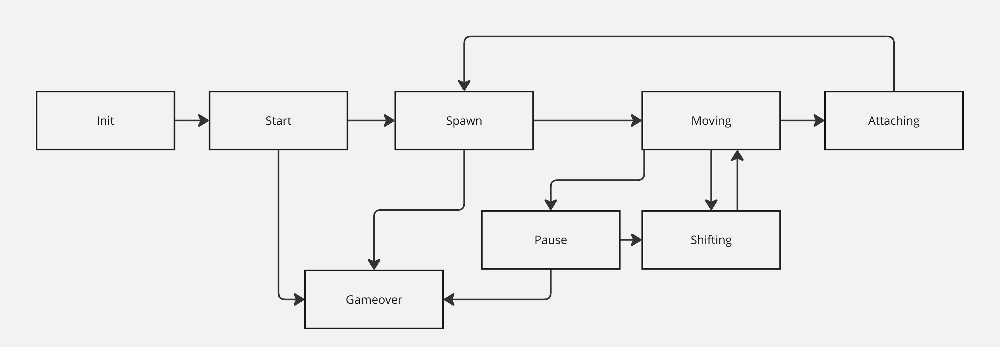

# Tetris

## Описание

Проект представляет собой игру «Тетрис» состоящую из двух частей: библиотеки, описывающей логику работы игры, которую можно в будущем подключать к различным GUI, и терминального интерфейса. Логика работы библиотеки реализована с помощью конечного автомата. Состояния КА и переходы между ними представлены на рисунке ниже:

**Функция вращения фигур находится в разработке**

## Структура проекта

Перед сборкой и запуском проекта рекомендуется перейти в ветку **demo**

    git checkout demo

Проект состоит из следующих директорий:

* brick_game - содержит исходный код игр (на данный момент - только тетрис)
  * tetris/inc - включает заголовочные файлы библиотеки
  * tetris/src - исходные файлы библиотеки
  * tetris/tests - описывает unit тесты
* gui - содержит графические интерфейсы игр

## Сборка и установка

### Подготовка

Убедитесь, что на вашей системе установлены следующие пакеты:

* gcc
* make
* libncurses-dev
* doxygen
* check
* lcov
* xdg-utils
* valgrind

В случае, если какой-либо из пакетов не установлен, выполните команду

    sudo apt install <название_пакета>

### Сборка

**Для сборки и запуска проекта используется Makefile. Все последующие команды следует выполнять, предварительно перейдя в src/brick_game/tetris.**

Чтобы собрать и установить игру, выполните команду

    make

Она соберет исходный код, создаст статическую библиотеку и установит игру в директории game_dir.

## Запуск игры

Для запуска игры, используйте

    ./game_dir/game

## Тестирование

Чтобы запустить unit тесты и сгенерировать отчет о покрытии кода, выполните команду

    make gcov_report

Для определения утечек памяти используется Valgrind. Чтобы запустить тесты или игру под Valgrind, используйте соответствующие команды 

    make vg

или

    make vg_game

## Документация

Команда ниже формирует документацию к проекту

    make dvi

Для просмотра документации следует открыть файл `index.html`, нахдящийся по адресу `./doxygen_dir/html`

## Очистка

Очистить директорию можно с помощью команды

    make clean

В случае необходимости пересобрать проект можно выполнить команду

    make rebuild

